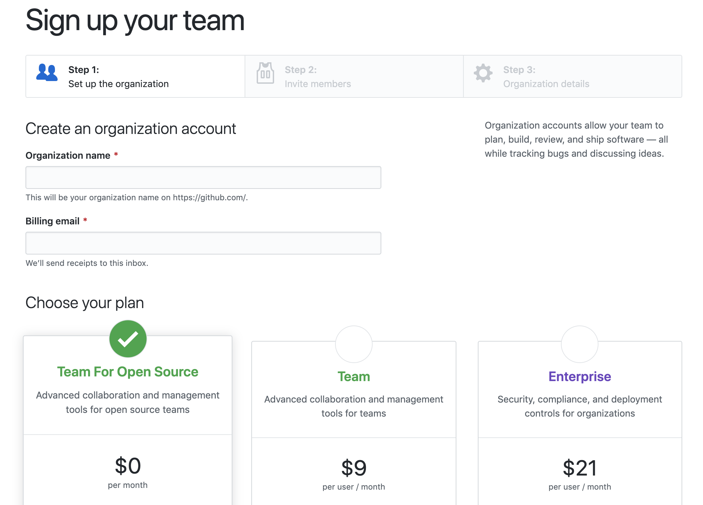
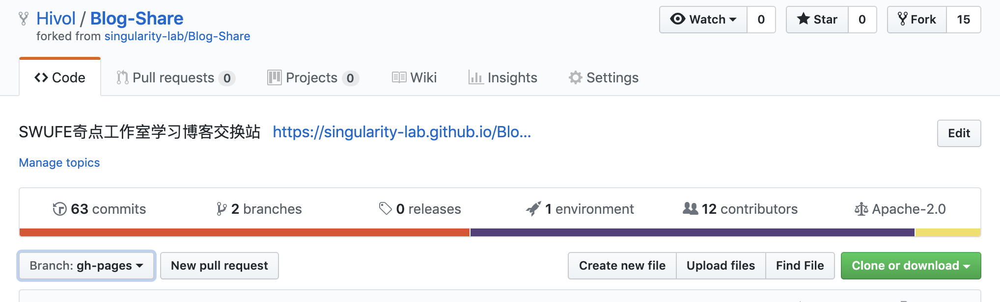

关于 git 以及 GitHub 的使用问题，网上已经有很多教程了，本文主要关注如何利用 GitHub 进行团队项目开发。

## 管理员前期准备

### Sign up your team

作为一个团队，首先需要在 GitHub 上注册一个 Organization，填好组织名称和 billing email，选择合适的付费方案就可以了。GitHub 也提供了免费的方案 Team For Open Source，这个免费方案只支持创建公开的仓库，需要私有库的话就只能选择付费方案了。



创建完组织之后就可以邀请成员加入了，可以为成员分配不同的小组，设置不同的权限。

> 想使用私有库进行团队协作的话也可以用个人账户创建仓库，邀请 Collaborators 加入。

### 创建公库

在 Organization 账户下创建公库，点进公库的 setting，选择 Collaborators & Teams 部分。在这里可以设置 Organization 下的各个 team 的权限，一般都设置为 read，其中 admin 小组是管理员小组，可以设置为 write。另外，也可以在 Collaborators 部分设置单个成员的权限。如图所示：


### 创建 dev 分支，成员 fork 到个人仓库

在团队协作开发的过程中，一般不直接在 master 分支上直接 commit。所以我们新建一个 dev 开发分支，以供团队成员开发。


在如图所示的地方，就可以直接创建分支，输入 dev 后回车即可。

然后让各成员 fork 到个人仓库。

## 各成员正式协作

### clone 到本地

通过 git 命令行工具或者 GitHub 客户端把 fork 后的个人仓库 clone 到本地。



点击右边的绿色按钮「Clone or Download」后，选择「Open in Desktop」边可以通过 GitHub 客户端 clone。

> 这一步操作的前提是已经配置好了 GitHub 客户端，下载地址在这里：[GitHub Desktop](https://desktop.github.com/)

另外，也可以通过命令行工具 clone。打开命令行工具，进入到你的工作区文件夹，输入以下命令：

```bash
git clone git@github.com:{your-name}/{your-repo}.git
```

（此处需要将 `{your-name}` 和 `{your-repo}` 替换为你的用户名和仓库名）

⚠️ clone 完成之后，默认是在 master 分支之下，需要自行切换至 dev 分支。

-   使用命令行

    ```bash
    git checkout dev
    ```

-   使用 GitHub Desktop

    直接在图形界面顶部菜单栏「Currenct Branch」中选择 dev 分支即可

### 提交 commit

Clone 到本地之后可以自由地使用 IDE 或者诸如 ATOM、VS Code 之类的编辑器进行开发，开发完成后需要提交你的更改。


-   使用命令行

    ```bash
    git add -A		//添加所有更改文件到暂存区（stage）

    git status		//查看 git 状态

    git commit -m "Your summary about this commit"		//提交你的更改，引号内的内容需自定义

    git status		//再次查看 git 状态
    ```

    也可以把两步操作合并在一起

    ```bash
    git commit -am "Your summary about this commit"
    ```

-   使用 GitHub Desktop

    在客户端左下角输入 summary 和 description 提交即可

> ⚠️ 尽可能清晰地描述此次 commit 所更改的信息，有助于团队成员的理解以及发生错误之后的回滚

### push 到远程仓库

#### 第一步：fetch 更改，解决冲突

-   使用命令行

    ```bash
    // 请确认当前是在 dev 分支下

    git fetch origin dev:tmp		//拉取最新版本到temp
    git diff tmp 		//比较最新分支与本地的的区别
    git merge tmp		//合并到本地
    ```

    > 解决冲突请参考 [解决冲突 - 廖雪峰的 git 教程](https://www.liaoxuefeng.com/wiki/0013739516305929606dd18361248578c67b8067c8c017b000/001375840202368c74be33fbd884e71b570f2cc3c0d1dcf000)

-   使用 GitHub 客户端

    点击客户端右上角的「fetch origin」，根据提示操作即可

#### 第二步：push 到远程仓库

-   使用命令行

    ```bash
    git push origin dev
    ```

-   使用 GitHub 客户端

    commit 所有更改后点击界面右上方的 push origin 即可

### 发起一个 pull request

回到 GitHub 网页中个人 fork 的仓库里，点击绿色按钮「Clone or Download」下方的 pull request，确认更改后，选择 「Create pull request」就好了。之后团队管理员会审核你们的更改，提出修改意见。再之后按照要求修改完成后，等待管理员合并即可。整个操作流程就此结束。

## 管理员审核 pull request

### 第一步：Code Review

进入公库的 pull request 列表，选择特定的 pull request。可以在右边的「reviewers」 处指定人员 Review 更改，也可以自己 Review。提出修改意见，等待团队成员修改。

### 第二步：Merge

确认修改无误后，点击「merge」按钮即可。

### 第三步：将 dev 分支合并到 master 分支

待到各成员的开发陆续提交到了 dev 分支，等一个大功能开发完成后，便可以把 dev 分支合并到 master 分支了。

进入到公库的远程仓库中，点击分支列表旁的「New pull request」，发起合并的 pull request，然后进行 Code Review 后确认 merge。

## 参考资料

1. [Difference between “git add -A” and “git add”](https://stackoverflow.com/questions/572549/difference-between-git-add-a-and-git-add)
2. [Git 教程 - 廖雪峰的官方网站](https://www.liaoxuefeng.com/wiki/0013739516305929606dd18361248578c67b8067c8c017b000)
