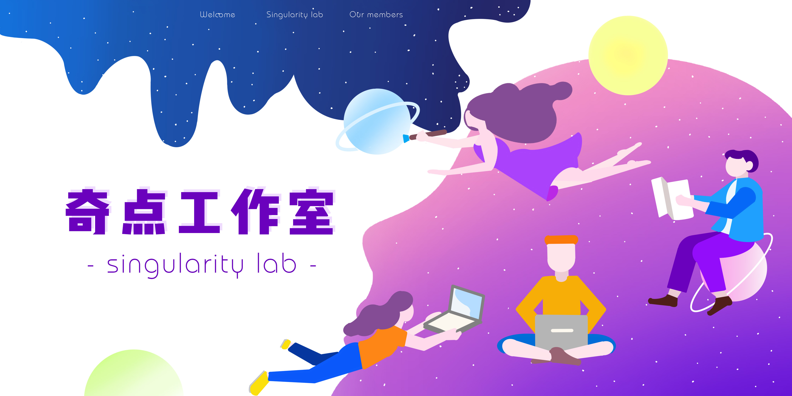

# 关于我们

:::tip
实践平台，实践舞台

精兵强将，信院之光
:::

**奇点工作室（Singularity Lab）** 是由经济信息工程学院原官网研发项目组发展而来的面向全校的学生组织。

工作室秉承“薪火相传、脚踏实地、锐意进取、通力协作”的团队精神，真诚欢迎热爱设计、应用程序开发与数据分析的同学加入。

-   平等、尊重与包容是我们的组织氛围
-   自由、沟通与协作是我们的工作方式
-   语言、框架与应用是我们的常用工具
-   学习、实践与成长是我们的最终目的

联系方式：SingularityLab@163.com
