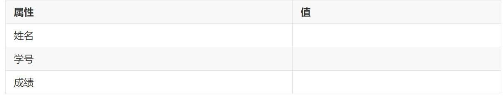

> 由于经常无法预约到合适时间段的洗衣位, 故准备利用计算机技术修改洗衣时段, 但微信内置浏览器不能查看或修改网页源代码, 而使用抓包等手段过于复杂, 所以选择用图像编辑技术修改预约信息图片, 在尝试了一次用 Photoshop 软件修改后, 感到十分麻烦, 因此决定写一个 Python 程序, 进行自动化编辑图像.

## PIL库

Python图像库 [PIL](http://pythonware.com/products/pil/) (Python Image Library) 是python的第三方图像处理库, 由于其强大的功能与众多的使用人数, 几乎被认为是python官方图像处理库.

### PIL 库的安装

执行命令行, 注意使用 `pip` 进行库的安装的时候 `PIL` 库的名字是 "pillow" 而不是 "PIL". (关于 PIL 与 pillow 的关系请自行查询)

```
pip install pillow
```

### PIL 库的基本使用方法

```python
from PIL import Image  # Image类是PIL的核心类, 支持对图像的加载, 创建, 展示, 保存等基本功能

im = Image.open('sample.png')  # 使用open方法打开一张图并生成一个图片实例, 参数为图片的路径, 这里请设置为你自己的图片路径
im.show()  # 使用show()方法, 展示图片
im.save('output.jpg', 'jpeg')  # 使用save()方法来保存一张图片到硬盘, 第一个参数为指定的保存路径, 第二个参数为图片的输出格式
```

### 图片的基本属性查看

```python
# 代码接上文
print(im.format, im.size, im.mode)  # 展示图像的格式, 大小, 颜色模式
print(im)  # 或者直接print(im)打印出im的相关信息
```

### 创建一张新的图片实例

```python
# 新的代码节
from PIL import Image
im_new = Image.new("RGB", (400,300))  # 创建一个内容空白的图片实例, 但是空白不代表图片是白色的, 而是黑色的, 因为什么都没有, new()方法的第一个参数是色彩模式, 第二参数是图片像素大小(宽,高)
im_new.save("blank.jpg","jpeg")  # 保存该图片, 去看看

im_new = Image.new("RGB",(250,250),"red")  # 我们加上第三个参数--颜色, 得到一个(250,250)的红色方形图片实例, 第三个参数可以是颜色名字符串, 也可以是十六进制RGB值字符串, 例如下面的
im_new_blue = Image.new("RGB",(250,250),"#0000FF")

im_new.save("red.jpg","jpeg")
im_new_blue.save("blue.jpg","jpeg")
```

到这一步, 就可以用**循环结构**来自动生成一系列你想要的颜色和大小的图片了.

下面我们来讲给图片加上文本.

### 为图片添加文本

```python
# 新的代码节
from PIL import Image, ImageDraw, ImageFont  # ImageDraw是对图片进行涂画的重要类, ImageFont是对文字属性操控的重要类, 如字体类型, 大小, 颜色等

im = Image.new("RGB", (400,300), "skyblue")
ft = ImageFont.truetype(r'C:\Windows\Fonts\msyh.ttc', 30)  # 创建一个字体实例, 第一个参数指向的某字体路径, 本例中为微软雅黑, 第二个参数是字体大小--30像素, truetype()方法加载一个TrueType或者OpenType字体文件, 并且创建一个字体对象.
draw = ImageDraw.Draw(im)  # 以im对象创建一个Draw实例, 用来进行涂写

draw.text((50,50), "python is cool", font=ft, fill="white")  # 使用text()方法为图片添加文字, 第一个参数表示位置(a,b), 图片左上角为原点, 右和下为a,b的正方向, font参数设置文本使用的字体, fill参数设置文本的颜色

im.show()  # 来看看效果, 注意是im.show()而不是draw.show(), 同理, 保存图片也是im.save()而不是draw.save()
```

至此, 我们对 `PIL` 库的介绍基本结束, 可以在网上查到它更多的功能. 另外, 关于图像与可视化, PIL 之于 matplotlib, 就像 C 之于 Python, matplotlib 虽然方便但是用途有限, 而 **PIL 提供更多底层的接口**, 可以绘制出更丰富的图形. 接下来进行一个练习.


##  练习: 在图片中填写信息

我们需要把表示 (姓名, 学号, 成绩) 的字符串`'张三,420123789,85'` 填写到图中对应的位置



代码如下:

```python
from PIL import Image, ImageFont, ImageDraw

im = Image.open('practice.jpg')
ft = ImageFont.truetype(r'C:\Windows\Fonts\msyh.ttc', 30)
draw = ImageDraw.Draw(im)
info = '张三,420123789,85'.split(",")

for i in range(len(info)):
	draw.text((720, 70 + i*60), info[i], font=ft, fill="#000000")

im.show()
im.save("practice.png",'png')
```

执行完代码后, 可以发现, 我们填入的**文本字号偏大**, **颜色太黑**, **位置也有少许偏移**, 这就需要自己进行微调. 讲一个小技巧, 在为元素确定位置坐标时, 可以**用 QQ 的截图功能, 方便地查看坐标值**, 或者用 Photoshop 中的标尺来定位, 以及用吸管工具来提取颜色. 另外, 字体的选择也十分重要, 这决定了填入的文本是否会显得格格不入. 通常来说, 微软雅黑是不错的选择.

现在, 你意识到了 `PIL` 库用途的强大之处了吗, 以及你想到了什么用 `PIL` 去实现的好点子吗?


## 附录: `ImageDraw` 的其他图形绘制方法

```python
draw.line([(50,50), (100,200)], fill='red')  # 直线
draw.arc([100,100,600,600],0,360, fill='black')  # 弧形
draw.ellipse([100,100,600,600],outline='black', fill='white')  # (椭)圆
draw.pieslice([100,100,600,600],180,210, outline=255)  # 扇形
draw.rectangle((200,200,500,500), outline = "red")  # 矩形
```


> 参考: 
>
> [PIL图像处理之 ImageDraw 与 ImageFont](https://blog.csdn.net/dxyna/article/details/81128297)
>
> [PIL 简明教程 - 基本用法](https://liam.page/2015/04/22/pil-tutorial-basic-usage/)

