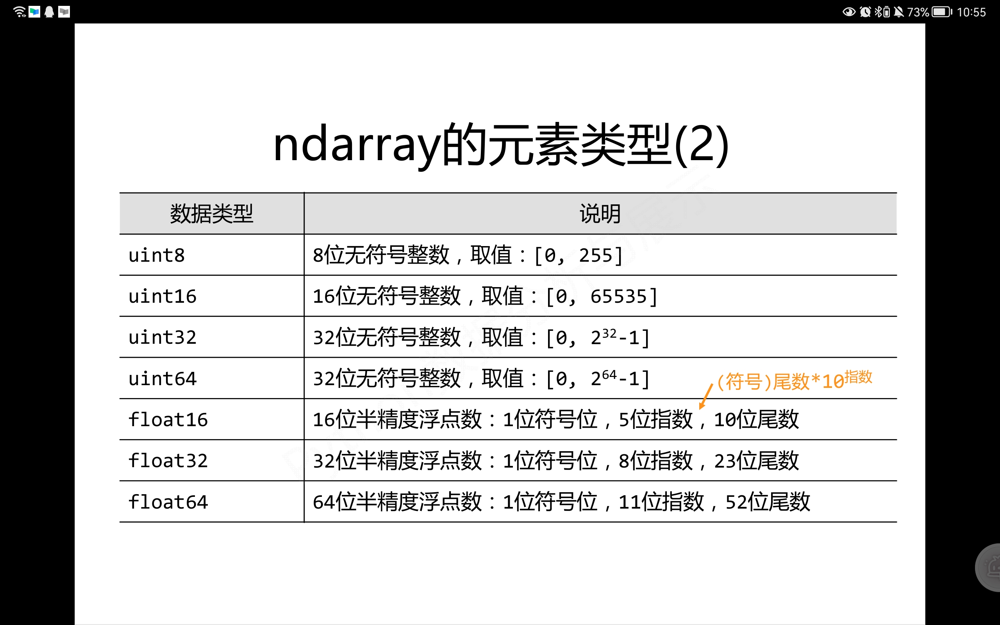

# 前言

Numpy库是Scipy、Pandas等数据处理或科学计算库的基础，此篇主要针对Numpy库的ndarray对象和与矩阵运算相关函数进行归纳。部分参考资料来自MOOC“python数据分析与展示”课程。

# Numpy的引用

```python
import Numpy as np
```

# Numpy数组对象——ndarray对象的属性

```python
import numpy as np

a = np.array([[0,1,2,3,4],[9,8,7,6,5]])

a.ndim #秩，即轴的数量或维度数
Out[3]: 2

a.shape #尺度，对于矩阵即n行m列
Out[4]: (2, 5)

a.size #元素个数，相当于n*m
Out[5]: 10

a.dtype #元素类型
Out[6]: dtype('int32')

a.itemsize #每个元素大小，以字节为单位
Out[7]: 4

```

# 数组的创建

## 1、从列表、元组创建

```python
x = np.array([1,2])

print(x)
[1 2]

x = np.array((1,2))

print(x)
[1 2]

x= np.array([[1,2],(3,4)])

print(x)
[[1 2]
 [3 4]]
 ```

 ## 2、使用函数创建

 ### 基础函数

 ```python
np.arange(10)   #生成0-(n-1)的向量
Out[15]: array([0, 1, 2, 3, 4, 5, 6, 7, 8, 9])

np.ones((2,3))  #生成元素均为1的矩阵
Out[16]: 
array([[1., 1., 1.],
       [1., 1., 1.]])

np.zeros((2,3))  #生成元素均为0的矩阵
Out[17]: 
array([[0., 0., 0.],
       [0., 0., 0.]])

np.eye(5)   #生成单位矩阵
Out[19]: 
array([[1., 0., 0., 0., 0.],
       [0., 1., 0., 0., 0.],
       [0., 0., 1., 0., 0.],
       [0., 0., 0., 1., 0.],
       [0., 0., 0., 0., 1.]])

np.full((2,3),5)  #生成值均为value的矩阵，value可指定
Out[20]: 
array([[5, 5, 5],
       [5, 5, 5]])
 ```

### 扩展函数

```python
a= np.array([[1,2],[3,4]])

 #根据a数组的形状填充数组

np.ones_like(a) 
Out[22]: 
array([[1, 1],
       [1, 1]])

np.zeros_like(a)
Out[23]: 
array([[0, 0],
       [0, 0]])

np.full_like(a,5)
Out[24]: 
array([[5, 5],
       [5, 5]])


#linspace函数，给定起始值、结束值、元素个数，等距输出数组

a=np.linspace(1,10,4)

a
Out[27]: array([ 1.,  4.,  7., 10.])

b= np.linspace(1,10,4,endpoint = False)  #endpoint：规定结束值是否包含在数组中

b
Out[29]: array([1.  , 3.25, 5.5 , 7.75])

```

### 数组拼接及插入函数

```python
B= np.array([[1, 2, 3],[2, 3, 4]])

C = np.array( [[ 3,6, 9 ]] )  

D = np.array( [ [ 5 ], [ 10 ] ] )


# 列拼接

np.concatenate((B,D),axis=1)  #axis表示在第几个维度进行拼接
array([[ 1,  2,  3,  5],
       [ 2,  3,  4, 10]])

#行拼接

np.concatenate((B,C),axis =0)  
array([[1, 2, 3],
       [2, 3, 4],
       [3, 6, 9]])

#append函数：降成一维

np.append(B,C)  
array([1, 2, 3, 2, 3, 4, 3, 6, 9])

#insert函数

np.insert(B,2,[10,7],axis=1)
array([[ 1,  2, 10,  3],
       [ 2,  3,  7,  4]])

np.insert(B,1,[2,2,2],axis=0)
array([[1, 2, 3],
       [2, 2, 2],
       [2, 3, 4]])

np.insert(B,1,[3],axis=1)
array([[1, 3, 2, 3],
       [2, 3, 3, 4]])

C = np.insert( B, 1, [3], axis = 0 )

C
array([[1, 2, 3],
       [3, 3, 3],
       [2, 3, 4]])

```

# 数组的维度变换

```python

# reshape函数：生成一个新维度的数组，不改变原数组

a.reshape((3,8))
Out[3]: 
array([[1, 1, 1, 1, 1, 1, 1, 1],
       [1, 1, 1, 1, 1, 1, 1, 1],
       [1, 1, 1, 1, 1, 1, 1, 1]])

a
Out[4]: 
array([[[1, 1, 1, 1],
        [1, 1, 1, 1],
        [1, 1, 1, 1]],

       [[1, 1, 1, 1],
        [1, 1, 1, 1],
        [1, 1, 1, 1]]])

#resize：对原数组进行操作

a.resize((3,8))

a
Out[6]: 
array([[1, 1, 1, 1, 1, 1, 1, 1],
       [1, 1, 1, 1, 1, 1, 1, 1],
       [1, 1, 1, 1, 1, 1, 1, 1]])

# flatten： 生成一个一维数组

a.flatten()
Out[7]: 
array([1, 1, 1, 1, 1, 1, 1, 1, 1, 1, 1, 1, 1, 1, 1, 1, 1, 1, 1, 1, 1, 1,
       1, 1])

```

# 数组的类型变换

```python

#astype:改变数组中元素的数据类型

new_a = a.astype(np.float64)

new_a
Out[10]: 
array([[1., 1., 1., 1., 1., 1., 1., 1.],
       [1., 1., 1., 1., 1., 1., 1., 1.],
       [1., 1., 1., 1., 1., 1., 1., 1.]])

```

# 数组转为列表

```python

#ls = a.tolist()

a.tolist()
Out[11]: [[1, 1, 1, 1, 1, 1, 1, 1], [1, 1, 1, 1, 1, 1, 1, 1], [1, 1, 1, 1, 1, 1, 1, 1]]

```

# 数组的索引和切片

此操作与Python中序列的索引与切片相同，以下针对多维数组的切片进行实例演示，主要理解对各个维度进行索引查值和切片的过程。

```python

a = np.arange(24).reshape((2,3,4))

```

## 索引

```python
a
Out[13]: 
array([[[ 0,  1,  2,  3],
        [ 4,  5,  6,  7],
        [ 8,  9, 10, 11]],

       [[12, 13, 14, 15],
        [16, 17, 18, 19],
        [20, 21, 22, 23]]])

a[1,2,3]   #最外层索引1，次外层索引2，里层索引3
Out[14]: 23

a[-1,-2,-3] 
Out[15]: 17


```

## 切片

```python

a[:,1,-3]
Out[16]: array([ 5, 17])

a[:,1:3,:]
Out[17]: 
array([[[ 4,  5,  6,  7],
        [ 8,  9, 10, 11]],

       [[16, 17, 18, 19],
        [20, 21, 22, 23]]])

a[:,:,::2]     #步长
Out[18]: 
array([[[ 0,  2],
        [ 4,  6],
        [ 8, 10]],

       [[12, 14],
        [16, 18],
        [20, 22]]])

```

# Numpy一元函数
 
对数组中的每个元素进行运算，如取绝对值、计算平方根、平方、对数、指数、三角函数等。不改变原数组。

```python

#部分函数实例

a
Out[20]: 
array([[0, 1, 2, 3, 4],
       [5, 6, 7, 8, 9]])

np.sqrt(a)
Out[22]: 
array([[0.        , 1.        , 1.41421356, 1.73205081, 2.        ],
       [2.23606798, 2.44948974, 2.64575131, 2.82842712, 3.        ]])

np.square(a)
Out[23]: 
array([[ 0,  1,  4,  9, 16],
       [25, 36, 49, 64, 81]], dtype=int32)

```

# Numpy二元函数

对两个***相同形状***的数组各元素之间进行运算，如四则运算，次方运算，最大最小值，模运算、比较等。

```python 
a= np.array([[1,2,3],[4,5,6]])

b= np.array([[4,5,6],[7,8,9]])

a+b
Out[27]: 
array([[ 5,  7,  9],
       [11, 13, 15]])

a*b              #若是矩阵运算，需要与点乘进行区别，此为对位乘法。
Out[28]: 
array([[ 4, 10, 18],
       [28, 40, 54]])

np.maximum(a,b)
Out[29]: 
array([[4, 5, 6],
       [7, 8, 9]])

```

# 与矩阵运算相关的操作

```python
a
Out[35]: 
array([[1, 2, 3],
       [4, 5, 6]])

b
Out[36]: 
array([[0, 1],
       [2, 3],
       [4, 5]])
```

## 点乘

应满足矩阵点乘条件

```python
a.dot(b)
Out[37]: 
array([[16, 22],
       [34, 49]])

np.dot(a,b)
Out[38]: 
array([[16, 22],
       [34, 49]])
```

## 求逆

***np.linalg.inv(array)***

实际运用是应先判断是否可逆，否则会报错。

```python

a
Out[46]: 
array([[1, 2, 3],
       [3, 3, 9],
       [2, 3, 4]])

np.linalg.inv(a)
Out[47]: 
array([[-2.50000000e+00,  1.66666667e-01,  1.50000000e+00],
       [ 1.00000000e+00, -3.33333333e-01,  8.32667268e-17],
       [ 5.00000000e-01,  1.66666667e-01, -5.00000000e-01]])

```

## 转置

```
a.T
Out[48]: 
array([[1, 3, 2],
       [2, 3, 3],
       [3, 9, 4]])
```

# 参考资料

有关随机数函数、统计函数、梯度函数的学习，详见之后的博客。若有错误之处，望大家指正！





