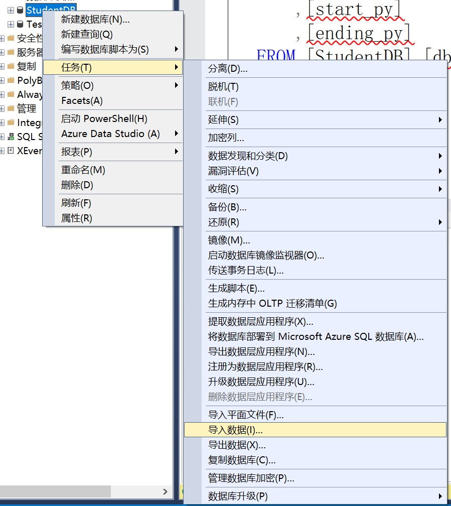
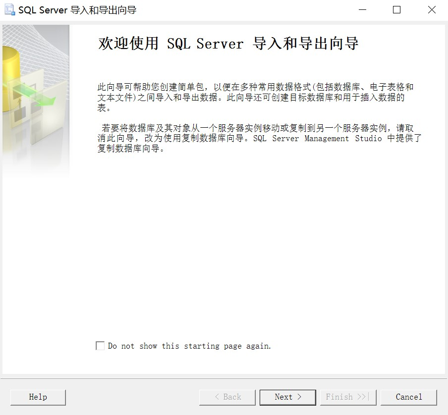
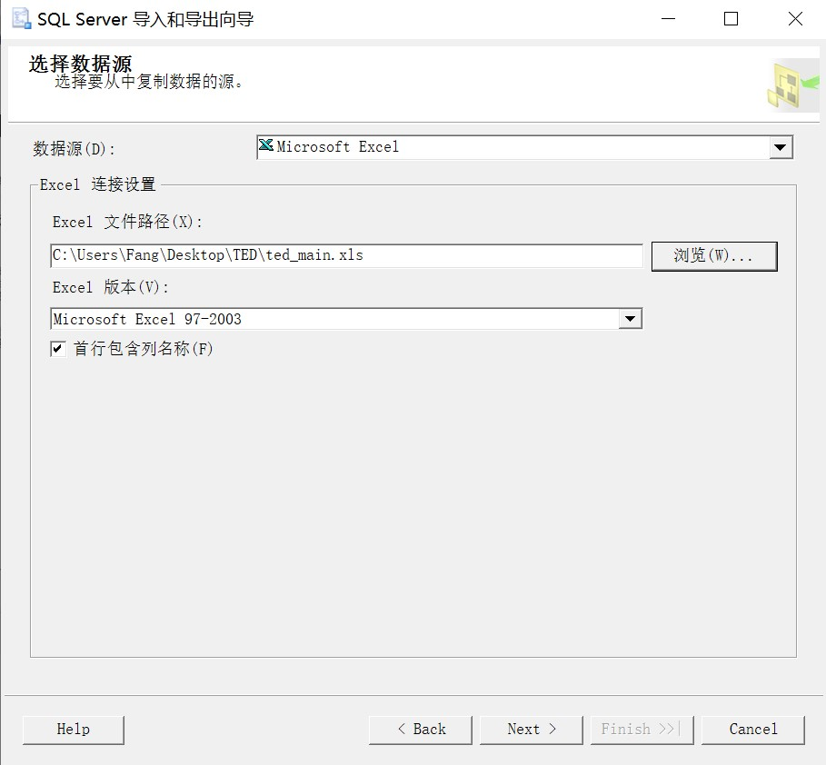
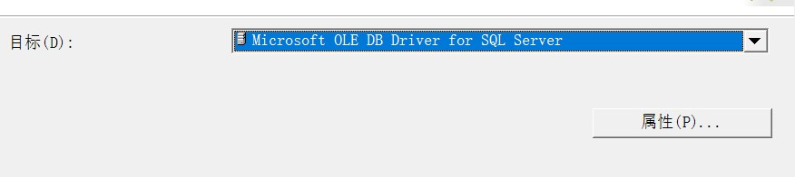
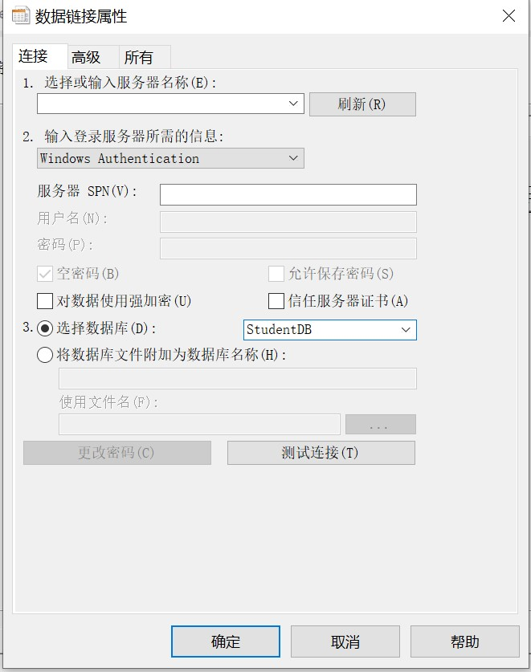

## 一、SQL server 导入数据指南

### **1. 导入Excel文档**

##### *文件类型必须为Microsoft Excel 97-2003 工作表

#### **（1）右击数据库——任务——导入数据**

#### **（2）出现向导**

#### **（3）数据源选择Excel**

#### **（4）目标选择microsoft OLE DB Driver for SQL Server，点击属性**

#### **（5）设置属性**
- 通过查询语句SELECT HOST_NAME( )获得服务器名称，复制粘贴到小框里
-  选择Windows authentication
-  选择导入的数据库
-  点击确定

#### **（6）接下来就是一路next，最后点finish**