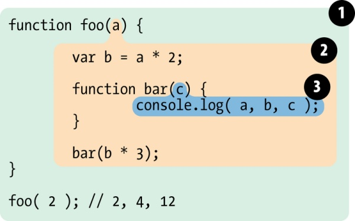

## 作用域

> 通常来说，一段程序代码中所用到的标识符并不总是有效/可用的，而限定这个标识符的可用性的代码范围就是这个标识符的作用域。

> 举例：
>
> ```javascript
> function foo(a) {
>   var b = a * 2;
>   function bar(c) {
>     console.log(a, b, c);
>   }
>
>   bar(b * 3);
> }
> foo(2); // 2,4,12
> ```
>
> 上述代码的作用域应作如下划分：
>
> 
>
> 作用域 1：包含全局作用域，有标识符：foo。  
> 作用域 2：包含 foo 所创建的作用域，有如下 3 个标识符：a、 b、 bar。  
> 作用域 3：包含 bar 所创建的作用域，有标识符：c。

在作用域 3 中，可以访问`c`，同时也可以访问作用域 2 的`a`、`b`。  
而在作用域 2 中，`c`不可访问。

总结：**函数的内部环境可以通过作用域链访问到所有的外部环境，但是外部环境却不可以访问外部环境**，这就是作用域的关键。

## 提升

### 变量提升

回到最简单的一个变量声明：

```javascript
var a = 2;
```

对这行代码，编译器会在编译阶段处理`var a`，并将`a = 2`留在原地等待执行阶段。这个过程就好像变量声明从它在代码中出现的位置被“移动”到了最上面，因此被称作变量提升。

举例：

```js
foo();

function foo() {
  console.log(a);
  var a = 2;
}
```

对于这段代码，首行的`foo()`可以正常执行，但是会输出`undefined`；
根据变量提升原理，这段代码实际相当于：

```js
function foo() {
  var a;
  console.log(a);
  a = 2;
}

foo();
```

### 函数提升

函数提升大部分与变量提升同理，但是有几点注意点：

1.  函数声明会被提升，函数表达式不会被提升。

举例：

```js
foo(); // 报TypeError错误

var foo = function() {
  var a;
  console.log(a);
  a = 2;
};
```

上述代码相当于：

```js
var foo;
foo(); // 此时 foo 为 undefined，而我们尝试对它进行函数式调用，属于不合理操作，报 TypeError 错误。
foo = function() {
  var a;
  console.log(a);
  a = 2;
};
```

2.  函数会被优先提升，然后是变量。

举例：

```js
foo(); // 1
var foo;
function foo() {
  console.log(1);
}
foo = function() {
  console.log(2);
};
```

这段代码提升之后相当于：

```js
function foo() {
  console.log(1);
}
foo();
foo = function() {
  console.log(2);
};
```

总结：**变量和函数在内的所有声明都会在任何代码被执行前首先被处理。**

## 闭包

> 闭包指有权访问另一个函数作用域中的变量的函数。

举例：

```js
function foo() {
  var a = 2;
  function bar() {
    console.log(a);
  }
  return bar;
}

var baz = foo();
baz(); //2
```

bar 拥有 涵盖 foo 内部作用域的闭包，使得该作用域能够一直存活，以供 bar 在之后任何时间进行引用。

bar 依然持有对该作用域的引用，而这个引用就叫作 闭包。

下面的代码预期每秒依次输出 1-5 的自然数，但是由于闭包原理，`timer`拥有全局作用域的闭包，只会在循环结束之后执行。

```js
for (var i = 0; i <= 5; i++) {
  setTimeout(function timer() {
    console.log(i);
  }, i * 1000);
}
```

一种改正方法是使用立即执行函数：

```js
for (var i = 0; i <= 5; i++) {
  (function(i) {
    setTimeout(function timer() {
      console.log(i);
    }, i * 1000);
  })(i);
}
```

还有一种是使用`let`代替`var`：

```js
for (let i = 0; i < 10; i++) {
  setTimeout(function() {
    console.log(i);
  }, 1000);
}
```

## 参考

1.  [李佳怡的纸糊](https://zhuanlan.zhihu.com/p/27110726)
2.  [廖雪峰的官方网站](https://www.liaoxuefeng.com/wiki/001434446689867b27157e896e74d51a89c25cc8b43bdb3000/00143449934543461c9d5dfeeb848f5b72bd012e1113d15000)
