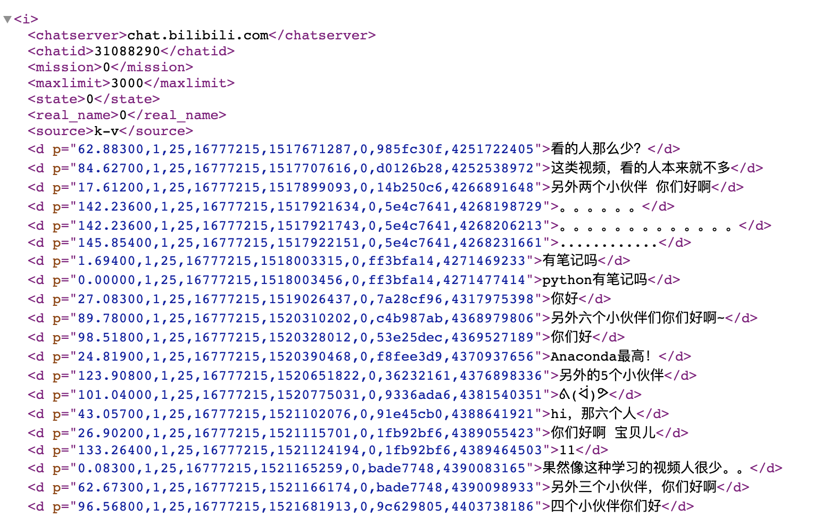

为了完成一个某课程的 research plan，本周写了一个获取 b 站弹幕并进行分析的小 demo。

## b 站视频 id 号

b 站有三种 id

1. `aid`：av 号
2. `cid`：chat id，也就是我们获取弹幕评论等需要的 id
3. `pid`：page id

我们需要关心的是 `aid` 和 `cid`。`aid`是视频的 av 号，即浏览器地址栏中的数字：`<https://www.bilibili.com/video/av19057145>`。而 `cid` 在页面资源中无法直接找到，通过 Chrome devtool 分析网络资源，可以找到一些文件叫做 `{cid}.xml`、`{cid}.png` 等以 `cid` 命名的文件。

进一步分析 `{cid}.xml` 可以发现 b 站每个分 p 的弹幕都存储在 `<http://comment.bilibili.cn/{cid}.xml>` 中。如图：



## 如何通过 `aid` 获取到 `cid`

b 站几乎封死了所有没有开发者 key 获取 `cid` 的渠道，通过搜索，找到了一个 API 可以获取到 `cid` ，详情见程序源码：[Hivol / Analyse_danmaku.py](https://gist.github.com/Hivol/a482d9573662306fece7ada9357ab8c0)

## 用 Python 下载弹幕

使用 `requests` 获取网页内容。

```python
def get_danmaku_list(cid):
    """
    通过 cid 获取所有弹幕
    :param cid: 视频的cid
    :return: 弹幕列表
    """
    response = requests.get(URL_GET_DANMAKU.format(cid), headers)
    response.encoding = 'utf-8'
    bs = BeautifulSoup(response.text)
    d_list = bs.find_all('d')
    print(len(d_list))
    danmaku_list = []
    for d in d_list:
        danmaku_list.append(d.text)
    return danmaku_list
```

## 存储弹幕到 txt 文件

由于 b 站视频多是分 p 的，所以需要把各 p 的弹幕保存在同一文件下。

```python
def write_text(aid, danmaku_list):
    """
    把同一 aid 下的所有弹幕写入同一文件中
    :param aid: aid
    :param danmaku_list: 弹幕列表
    """
    with open('danmaku/' + str(aid) + '.txt', 'a+', encoding='utf-8') as f:
        for danmaku in danmaku_list:
            f.write(str(danmaku) + "\n")
```

## 使用敏感词词库来判断弹幕是否违规

此处使用了 GitHub 上一个开源的敏感词库：[fighting41love / funNLP](https://github.com/fighting41love/funNLP)

```python
def load_words(url):
    """
    加载敏感词列表
    :param url: 相对路径
    :return: 敏感词列表
    """
    with open(url, 'r') as f:
        doc = f.readlines()
        words = [word.strip() for word in doc]
        return words


def judge_danmaku(sentence_list, judge_list):
    """
    判断同一视频下含有敏感词的比例
    :param sentence_list: 一条条弹幕的列表
    :param judge_list: 敏感词列表
    :return: 含敏感词的弹幕数量；弹幕总数
    """
    pron_list = load_words(judge_list)
    pron_count = 0
    total_count = 0
    for sentence in sentence_list:
        words = jieba.cut(sentence)
        for word in words:
            if word in pron_list:
                pron_count += 1
                break  # 已判定该句含有敏感词语，不需继续判断
        total_count += 1
    return pron_count, total_count
```

## 参考资料：

1. [中文 NLP 语料库](https://github.com/fighting41love/funNLP)
2. [程序源码](https://gist.github.com/Hivol/a482d9573662306fece7ada9357ab8c0)
