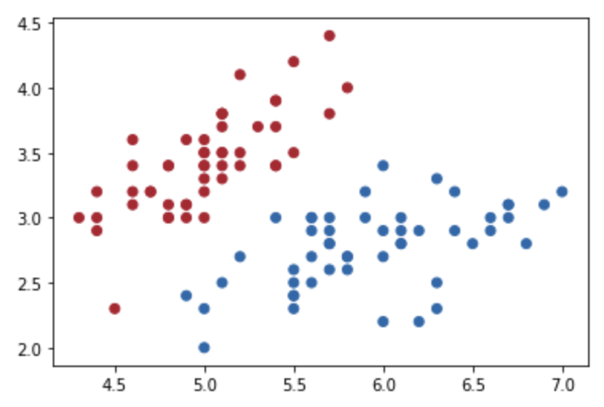
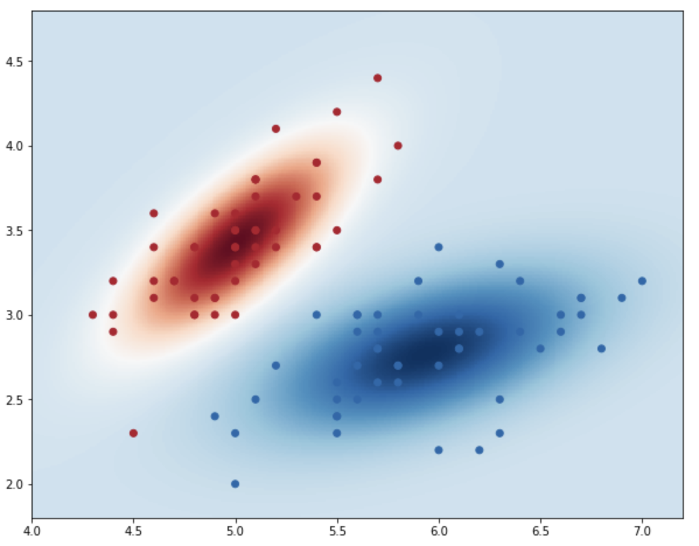

本篇博客主要使用 Python 的 [MatPlotLib](https://matplotlib.org/) 绘制二维数据的散点图和密度热度图（Density Heatmaps）。

<!-- more -->

## 1. 导入数据，进行预处理

本次使用的数据是 鸢尾花 Iris 数据集。为了简化实验，只取 sepal length (cm) 和 sepal width (cm) 两个属性和 setosa, versicolor 两个类别。

```python
# 引入包
import numpy as np
import matplotlib.pyplot as plt
from sklearn.datasets import load_iris
from palettable.colorbrewer.diverging import RdBu_7, RdBu_11  # 配色方案

# 引入 Iris 数据集
iris = load_iris()
X = iris.data
y = iris.target

# 处理成二维数据的二分类问题
X_2d = X[:, :2]
X_2d = X_2d[y < 2]
y_2d = y[y < 2]
```

## 2. 画出散点图

利用 matplotlib.pyplot.scatter 画散点图，配色方案选用 ColorBrewer 2 的 [RdBu 配色](https://jiffyclub.github.io/palettable/colorbrewer/diverging/#rdbu_7)。

```python
plt.scatter(X_2d[:, 0], X_2d[:, 1], c=y_2d, cmap=RdBu_7.mpl_colormap)
```



## 3. 计算高斯分布概率密度

观察上方的散点图，发现横轴数据在 4 到 7.2 之间，纵轴数据在 1.8 到 4.8 之间。使用 numpy 生成横轴纵轴数据。`np.linspace` 的第三个参数是生成数据的个数，使用这个参数来控制热力图所渲染的点的个数，以控制图像的平滑程度。

```python
x = np.linspace(4, 7.2, 300)
y = np.linspace(1.8, 4.8, 300)
```

目前，横轴有 300 个点，即向量 x；纵轴有 300 个点，即向量 y。接着使用 `np.meshgrid` 生成网状坐标点，将向量 x 和 y 定义的区域转换成矩阵 X 和 Y。关于 `np.meshgrid` 的使用可以参考[这个网页](https://numpy.org/doc/stable/reference/generated/numpy.meshgrid.html)。

```python
X, Y = np.meshgrid(x, y)  # X.shape: (300, 300)
points = np.c_[X.ravel(), Y.ravel()]  # points.shape: (90000, 2)
```

计算鸢尾花数据每个类别中两个属性的均值向量和协方差矩阵。

```python
mu_2D_l0 = np.mean(X_2d[y_2d==0], axis=0)  # shape: (2,)
cov_2D_l0 = np.cov(X_2d[y_2d==0, 0], X_2d[y_2d==0, 1])  # shape: (2, 2)

mu_2D_l1 = np.mean(X_2d[y_2d==1], axis=0)  # shape: (2,)
cov_2D_l1 = np.cov(X_2d[y_2d==1, 0], X_2d[y_2d==1, 1])  # shape: (2, 2)
```

计算每个类别的分布概率密度

```python
from scipy.stats import multivariate_normal

C_l0 = multivariate_normal.pdf(points, mean=mu_2D_l0, cov=cov_2D_l0)  # shape: (90000,)
C_l1 = multivariate_normal.pdf(points, mean=mu_2D_l1, cov=cov_2D_l1)  # shape: (90000,)

C_l0 = C_l0.reshape(X.shape)  # shape: (300, 300)
C_l1 = C_l1.reshape(X.shape)  # shape: (300, 300)
```

这样，我们便得到了坐标图上的 300\*300 个点 `points` 和两个类别下这 90000 个点分别所对应的高斯分布概率密度

## 4. 绘制密度热力图（Density Heatmaps）

绘制热度图使用的是 `pcolormesh` 函数。下方第一步的目的是实现“正数一个颜色，负数一个颜色“的效果。

```python
C = C_l1 - C_l0

plt.figure(figsize=(10, 8))

plt.pcolormesh(X, Y, C, cmap=RdBu_11.mpl_colormap)
plt.scatter(X_2d[:, 0], X_2d[:, 1], c=y_2d, cmap=RdBu_7.mpl_colormap)
```



## 5. 后记

多元正态分布的概率密度是由协方差矩阵的特征向量控制旋转(rotation)，特征值控制尺度(scale)，除了协方差矩阵，均值向量会控制概率密度的位置。这张热力图中可以看到大部分被蓝色覆盖，计算两个类别的协方差矩阵的特征值：

```python
np.linalg.eig(cov_2D_l0)[0]  # array([0.03427804, 0.23366074])

np.linalg.eig(cov_2D_l1)[0]  # array([0.30207198, 0.06283007])
```

## 参考资料

1. [RBF SVM parameters - scikit-learn.org](https://scikit-learn.org/stable/auto_examples/svm/plot_rbf_parameters.html)
2. [如何直观地理解「协方差矩阵」？ - 知乎](https://zhuanlan.zhihu.com/p/37609917)
3. [numpy meshgrid - 简书](https://www.jianshu.com/p/119eed3dc5e5)
