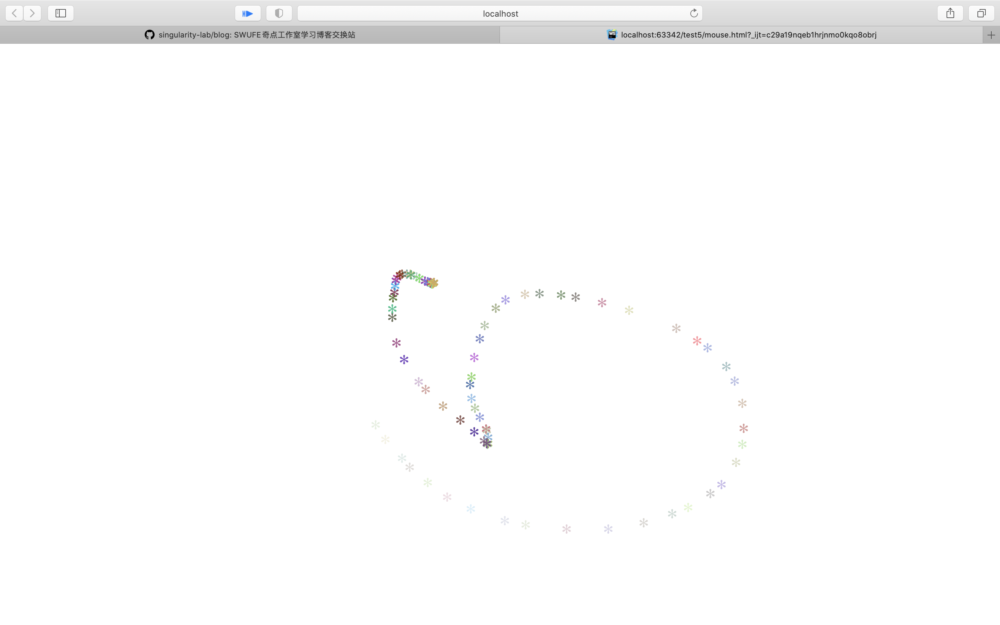

在很多网站中，我们可以看到随着鼠标的移动，会生成许多的特效，今天就来分享一下如何利用Javascript来制作这种特效
<br>

# 思路流程
<br>

1. 利用Javascript动态生成`div`<br>
2.  对该`div`进行样式设置
3. 设定该元素对随机颜色
4.  设定该元素生成一段时间后的自动消失消失效果

<br>

## 1.利用JavaScript动态生成`div`，并对该`div`进行样式设置
<br>

使用`window.onmousemove` ，当用户移动鼠标触发`function (event)`事件;<br>
在该事件中`document.createElement("div")`来生成一个新的`div`;<br>
使用`document.body.appendChild(newEle)`来添加一个元素；
```javascript
window.onmousemove = function (event) {

        var newEle = document.createElement("div");

        document.body.appendChild(newEle)

        }
```
<br>

## 2.对该`div`进行样式设置
<br>
首先利用`<style></style>`对该元素的布局以及大小进行设置

```css
<style type="text/css">

    div {
        position: absolute;
        display: block;
        font-size: xx-large;
    }

</style>
```
然后设置其跟尾字符以及相对光标可视区域的X，Y坐标（窗口坐标），px为增加数值的单位

```js
newEle.innerHTML = "*";//设置跟尾字符

newEle.style.left = (event.clientX + 5)+"px";

newEle.style.top = (event.clientY + 5)+"px";
```
<br>

## 3.设定该元素的随机颜色产生
<br>

利用`Math.floor`以及`Math.random()`函数随机生成`rgb()`中颜色的值达到随机生成效果

```js
var coor = "rgb(" + Math.floor(Math.random() * 256) + "," 

+ Math.floor(Math.random() * 256) + "," 

+ Math.floor(Math.random() * 256) + ")"


newEle.style.color = coor;
```
<br>

## 4.设定该元素生成一段时间后的自动消失消失效果
<br>

```js
//设置逐渐消失的秒数，数字是几就是几秒消失
var opacity = parseFloat(1);
        //透明度为0后移除该元素
        var setInterval = window.setInterval(
            function () {
                if (opacity <= 0) {
                    window.clearInterval(setInterval);
                    newEle.remove();
                } 
                //让元素逐渐半透明直至消失
                else {
                    opacity = (opacity - 0.1);
                    newEle.style.opacity = opacity;
                }
            }, 100)
```
<br>

## 将该段代码合并运行，并查看效果
<br>


```css
<style type="text/css">

    div {
        position: absolute;
        display: block;
        font-size: xx-large;
    }
</style>
```
```js
<script type="text/javascript">

    window.onmousemove = function (event) {

        var newEle = document.createElement("div");
        document.body.appendChild(newEle)

        newEle.style.left = (event.clientX + 5);
        newEle.style.top = (event.clientY + 5);
        newEle.innerHTML = "*";

        var coor = "rgb(" + Math.floor(Math.random() * 256) 
        +"," + Math.floor(Math.random() * 256) + ","
        + Math.floor(Math.random() * 256) + ")"
        newEle.style.color = coor;

        var opacity = parseFloat(1);
        var setInterval = window.setInterval(
            function () {
                if (opacity <= 0) {
                    window.clearInterval(setInterval);
                    newEle.remove();
                } else {
                    opacity = (opacity - 0.1);
                    newEle.style.opacity = opacity;
                }
            }, 100)
    }
</script>
```
<br>


