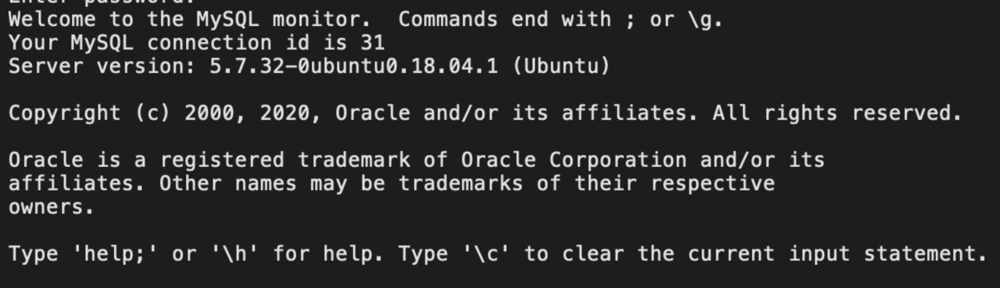
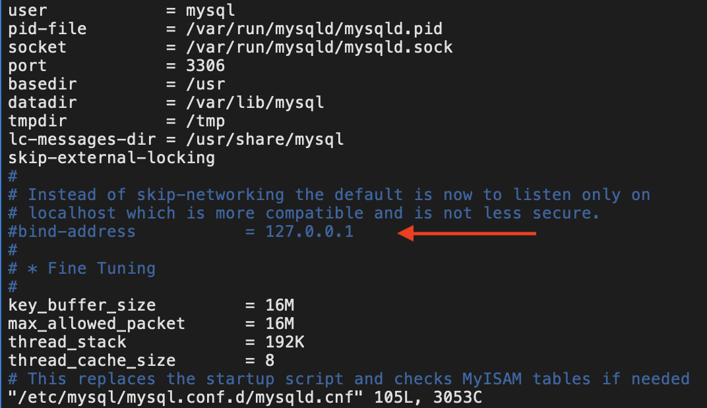
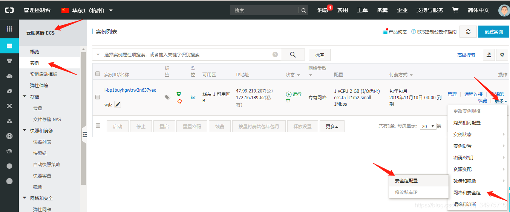
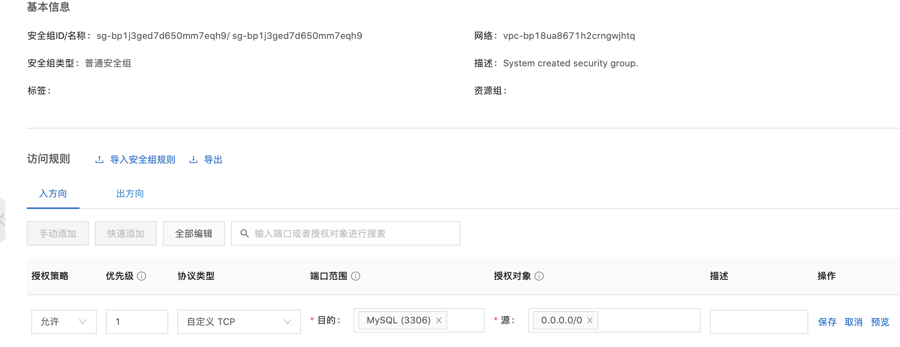
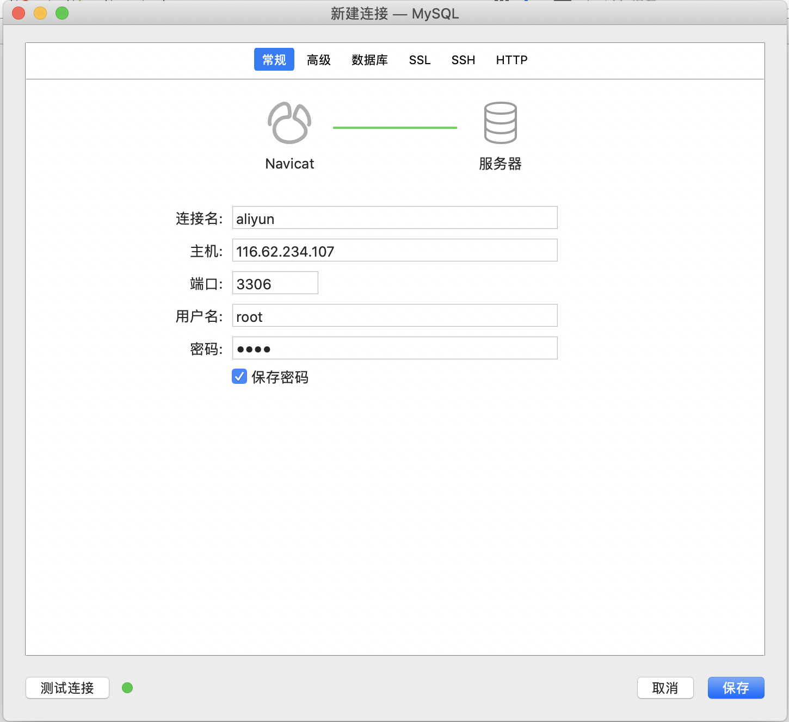

    在团队开发协作中，我们经常会用到数据库，但是随着ip地址的变动，连接到一人电脑上的数据库会出现一些问题，这时，使用云数据库就可以方便大家随时随地共同维护一个数据库啦
<br>

# 思路流程
<br>

1. 下载mysql
2. 本地测试
3. 连接配置
4. 阿里云配置

<br>

## 1.下载安装`mysql`

<br>
  
```
apt-get install mysql-server
  
apt-get install mysql-client
```
###  下载安装过程中可能需要你设置登陆密码  
<br>

## 2.本地测试
<br>


```
mysql -uroot -p
  
回车后输入密码
```
出现如下情况则本地登陆成功
  

  <br>

## 3.远程连接配置
` ` 
### (1)修改配置文件
<br>
默认mysql数据库都只能本地访问，这时我们需要首先更改配置文件

```
vim /etc/mysql/mysql.conf.d/mysqld.cnf
```
找到bind-address = 127.0.0.1这一行将其注释掉。
  


保存退出后重启mysql
```
service mysql restart
```
<br>

### (2)创建远程连接用户
<br>
登录mysql后执行下面语句, 表示将所有权限赋予给 root 用户，允许其进行远程登录

```
grant all privileges on *.* to'root'@'%' identified by 'root' with grant option;
```
  
***参数解释：***
  

(1)all privileges：赋予所有的权限给指定用户，也可以替换为赋予某一具体的权限
  
(2)*.*：所赋予的权限是针对全部数据库的全部表。
  
(3)root：表示给root用户授权


(4)‘%’：表示不限制连接的 IP。若想只允许某特定的 IP 进行远程登录，可以改为具体 IP。
  
(5)by ‘root’：root 用户的密码
  
  <br>
    
然后刷新立即生效
```
flush privileges;
```

## 4.阿里云配置
<br>
阿里云的服务器设置了安全组规则来限制ecs服务器的ip,端口访问策略。因此需要修改。
  
登录阿里云，然后控制台
  


然后配置规则 --> 添加安全组规则，在弹出框里设置如下参数，然后确定



最后在本地navicat测试连接


  
