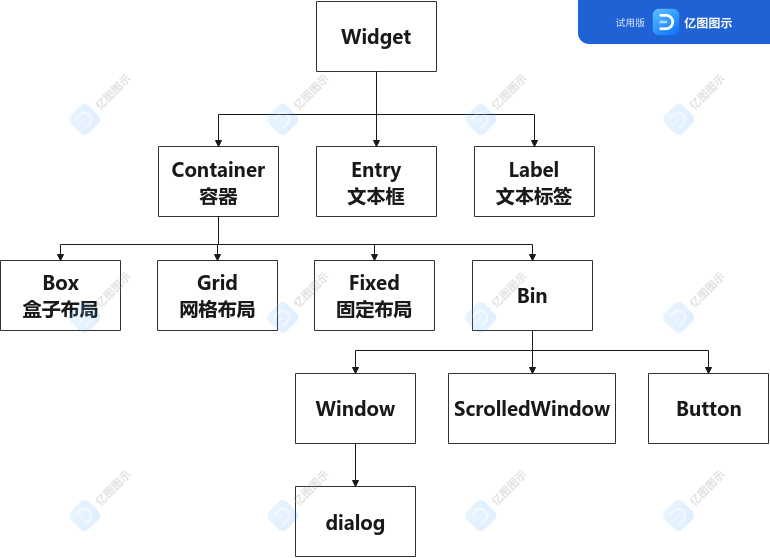
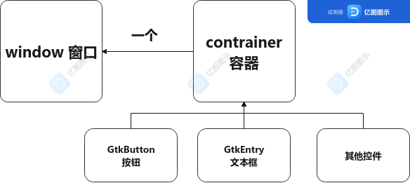

# Gtk 入门教程(一)

## 一、Gtk 简介

Gtk 是一个用来写图形用户界面程序的支持跨平台的免费开源库。
Gtk 是用 C 语言写成，但是被设计成可以支持多种语言（例 Python,JavaScript,C++,Rust 等）。
Gtk 迎合许多特性，例如原生外观、主题支持、面向对象的方法。

## 二、Gtk 的控件

Gtk 的控件之间存在继承关系，子类可以继承父类的相关功能函数。



## 三、Widget 基本操作

| 函数                                                      | 功能                                  |
| --------------------------------------------------------- | ------------------------------------- |
| gtk_widget_show(widget)                                   | 显示控件                              |
| gtk_widget_hide(widget)                                   | 隐藏控件                              |
| gtk_widget_set_sensitive(widget,sensitive)                | 禁用/启用控件                         |
| gtk_widget_set_size_request(widget,width,height)          | 设置控件'建议'大小                    |
| gtk_widget_destroy(widget)                                | 销毁控件                              |
| gtk_widget_set_resizable(widget,resizable)                | 设置控件能否进行缩放                  |
| gtk_window_set_position(window,GTK_WIN_POS_CENTER_ALWAYS) | 设置窗口位置(屏幕正中央)              |
| gtk_window_maximize(window)                               | 最大化窗口控件                        |
| gtk_container_add(container,widget)                       | 子控件 widget 添加到容器 container 中 |



## 四、第一个 Gtk 程序

第一个 Gtk 程序实现的界面仅仅是一个标题为 title 的居中窗口。点击关闭窗口后，正常退出。

```c
#include <stdio.h>
#include <gtk/gtk.h>
int main(int argc,char **argv)
{
    gtk_init(NULL,NULL);
    GktWindow* win = gtk_window_new(GTK_WINDOW_TOPLEVLE);
    gtk_window_set_position(win,GTK_WIN_POS_CENTER_ALWAYS);
    gtk_widget_set_title(win,"title");
    g_signal_connet(win,"destroy",gtk_main_exit,NULL);
    gtk_widget_show(win);
    gtk_main();
    return 0;
}
```

## 五、GTK 命名规则

1. 函数一般以"gtk\_"开头
2. 以`gtk_widget`开头的函数可应用于 GtkWidget 及其所有子类
   以`gtk_container`开头的函数可应用于 GtkContainer 及其所有子类
3. `gtk_AAA_new()` 用于创建一个 AAA 类型控件的指针
4. `gtk_AAA_get_BBB()` 获得 AAA 类型控件的 BBB 属性
5. `gtk_AAA_set_BBB()` 设置 AAA 类型控件的 BBB 属性

## 五、windows 添加子控件

添加子控件的流程是创建，显示，添加到容器或窗口中。

1. GtkEntry (文本框/输入框)

```c
GtkEntry* entry = gtk_entry_new();
gtk_widget_show(entry);
gtk_container_add(win,entry);
```

2. GtkButton (按钮)

```c
GtkButton* btn = gtk_button_new();
gtk_button_set_label(btn,"点击");
// 或者创建的同时设置文本标签
// GtkButton* btn = gtk_button_new_with_label("点击");
gtk_widget_show(btn);
gtk_container_add(win,btn);
```

3. GtkLabel (文本标签)

```c
GtkLabel* label = gtk_label_new("标签");
gtk_widget_show(label);
gtk_container_add(win,label);
```

## 参考资料

1. [Gtk 官网](https://www.gtk.org/)

2. [C 语言开发 GTK 界面](https://www.bilibili.com/video/BV155411w7ix)
