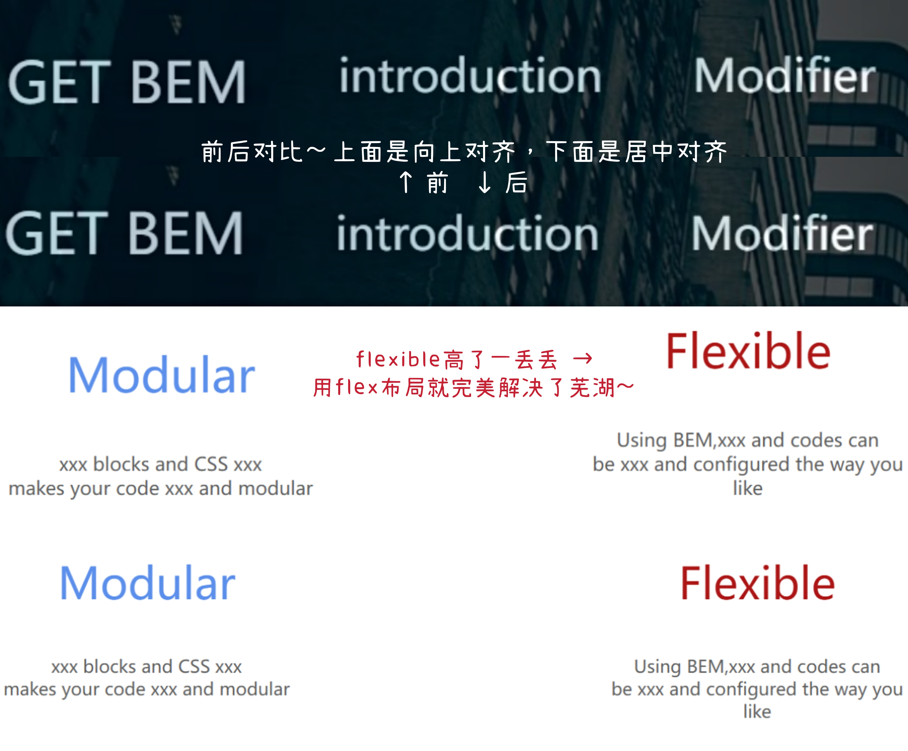

#CSS学习（flex布局、规范命名法、适应屏幕大小、颜色选择）

###一、flex布局

&emsp;&emsp;flex布局意为“弹性布局”。使用flex布局时需要设置容器（flex）的属性和容器里的子元素，即项目（item）的属性。使用flex布局:
	
	.box{
		display:flex;
	}

&emsp;&emsp;在第一次作业中有三个块级元素需要并列在一行显示，上次作业中用了以下方法：

	.box div{
    ……
    display:inline-block;/*块级元素不独占一行*/
    width:30%/*用百分比设置宽度*/
	}

&emsp;&emsp;但是出现了三个块级元素的小标题不在一行的情况。这次用flex布局试一下：

	.advantage{
    display:flex;/*运用flex布局*/
    flex-direction:row;/*主轴方向，即项目排列方向*/
    justify-content:center;/*项目在主轴上的对齐方式*/
    align-items:baseline;/*项目在交叉轴上的对齐方式*/
	}

&emsp;&emsp;同时设置一下项目的属性：

	.item1{
	    flex:1 1 auto;
	    text-align:center;
	    color:dimgray
	}

&emsp;&emsp;也可以！  
&emsp;&emsp;尝试一下在导航栏中也用flex布局：

	ul {
    display:flex;/*在导航栏里用flex布局*/
    align-items:center;
	/*设置item在交叉轴上的对齐方式，让字号不同的字体从中间对齐*/
    ……}

&emsp;&emsp;可以使不同字号的字从中间对齐~

对比图：

图好像出不来……

###二、规范命名法

具体参考链接：[web前端命名规范](cnblogs.com/menggirl23/p/12012351.html)，[web前端命名规范整理](https://www.jianshu.com/p/6417143c4b18)。以下补充BEM命名规范。

1. BEM命名规范：BEM是块（block）、元素（element）（block中的元素）、修饰符（modifier）(模块处于某种状态)的简写，由一种前端CSS命名方法论。

2. BEM命名约定的模式： 
`.block{}` 
`.block__element{}` 
`.block--modifier{}`

3. 例： 
Block:`header`,` container`, `menu`,` checkbox`, `input` 
Element:`menu item`, `list item`, `checkbox caption`, `header title` 
Modifier:`disabled`, `highlighted`,` checked`, `fixed`,` size big`, `color yellow`

BEM实例：

	

		

			<u1 class="card__list">
				<li class="card__item card__item--active">手机</li>
				<li class="card__item">科技</li class="card__item">
			</u1>
			
文字文字文字

			<a class="card__link" href="#">详细内容</a>
		
	
	

###三、适应不同屏幕大小

插入以下代码，可以实现自适应各个设备：

	<meta name="viewport" content="width=device-width,initial-scale=1,
	minimum-scale=1,maximum-scale=1,user-scalable=no"/>

注：width=device-width：宽度等于当前设备的宽度 
height=device-height：高度等于当前设备的高度 
initial-scale：初始的缩放比例（默认1） 
minimum-scale：允许用户缩放到的最小比例（默认1） 
maximum-scale：允许用户缩放到的最大比例（默认1） 
user-scale：用户是否可以手动缩放（默认no，用户不能放大缩小页面）

（不知道成没成功orz，好像效果出不来）

###四、颜色选择

第一次作业中的颜色可以用：[RGB颜色选择器](https://tool.oschina.net/commons?type=3)

###五、参考链接

[flex布局教程](https://www.runoob.com/w3cnote/flex-grammar.html)

[CSS BEM 命名规范（bilibili）](https://www.bilibili.com/video/BV1CN411o7L2?from=search&seid=18441207649945600418&spm_id_from=333.337.0.0)

[网页自适应屏幕（bilibili）](https://www.bilibili.com/video/BV1tt411x7YD?from=search&seid=11810078744292121594&spm_id_from=333.337.0.0)